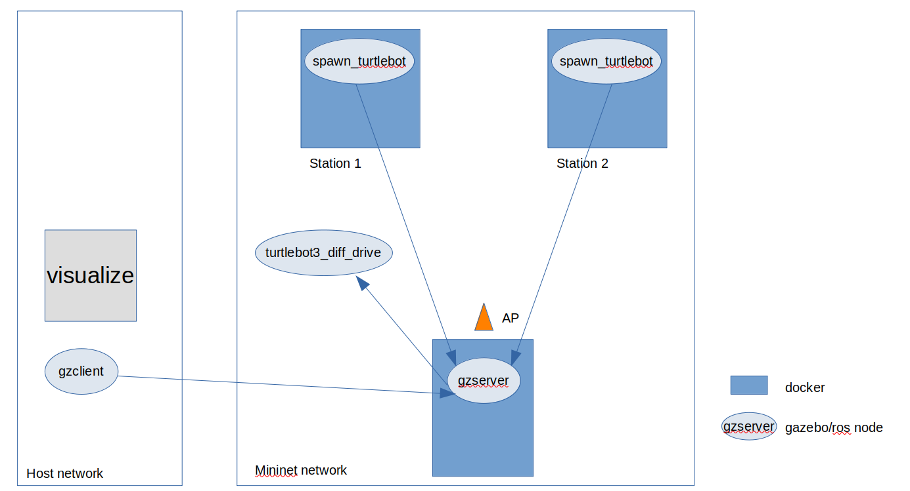

# CORNET2.0

Co-Simulation Framework for applications involving Networked Robots like Connected Autonomous Vehicles, Network of UAVs. 

---
 
CORNET 1.0 integrates Ardupilot SITL in Gazebo and NS3 and the source code is available [here](https://github.com/srikrishna3118/CORNET.git).

CORNET 2.0 is more generic framework that can be integrated with any robotic framework that supports ROS. This code was tested on an Ubuntu 16.04 and Ubuntu 18.04 system.

For network realization, we use Mininet Wi-Fi; the dependent packages need to installed as mentioned in mininet wifi documentation. This work is submitted for review (COMSNETS 2022). If you find this code useful in your research, please consider citing:

```
@misc{acharya2021cornet,
    title={CORNET 2.0: A Co-Simulation Middleware for Robot Networks}, 
    author={Srikrishna Acharya and Bharadwaj Amrutur and Mukunda Bharatheesha and Yogesh Simmhan},
    year={2021},
    eprint={2109.06979},
    archivePrefix={arXiv},
    primaryClass={cs.RO}
}
```

## Installation

### mininet-WiFi + Containernet Support

**We highly recommend using Ubuntu version 16.04 or higher. Some new hostapd features might not work on Ubuntu 14.04.**

```bash
sudo apt install libnl-route-3-dev
pip3 install docker-py
sudo update-alternatives --install /usr/bin/python python /usr/bin/python3 1 

sudo apt-get install git
sudo apt-get install ansible git aptitude
git clone https://github.com/ramonfontes/containernet.git
cd containernet/ansible
~/containernet/ansible$ sudo ansible-playbook -i "localhost," -c local install.yml
cd ..
~/containernet$ sudo python setup.py install
```

### ROS2

The Docker with ROS2 support provided in docker_container folder along with other wireless tools for testing and evaluation.

build.sh script will build and tag the images required for running. you can add you own Dockerfile based on the file Dockerfile

### Prebuilt docker image

You can also use a pre-built docker image which can be downloaded from [here](https://drive.google.com/file/d/1PNWrrP4M3ikoyO_3HJ730YSZ5dLxTIO7/view?usp=sharing)
then you can load the image with the following command:

```bash
docker load -i containernet_foxy.tar
```

## Gazebo in docker
### Architecture graph


### Run
build docker
```bash
$ cd docker_container
# First build Dockerfile.focalfoxyNWH
$ docker build -t cornet:focalfoxyNWH -f Dockerfile.focalfoxyNWH .
# Then build Dockerfile.khinggan
$ docker build -t commbot:khinggan -f Dockerfile.khinggan .
```
network_config
```bash
$ cd CORNET2.0
$ sudo python3 network/network_config.py test.yaml
```
gzserver and spawn robots
```bash
containernet> xterm robot1
containernet> xterm robot2

# in xterm robot1
$ source /opt/ros/foxy/setup.bash
$ gzserver --verbose -s libgazebo_ros_factory.so

# in xterm robot2
$ source /opt/ros/foxy/setup.bash
# replace parameters in <> 
# ros2 run robot_spawner_pkg spawn_turtlebot <robot_name> <robot_namespace> <position_x> <position_y> <position_z>
# for example
$ ros2 run robot_spawner_pkg spawn_turtlebot tb3_0 tb3_0 0.0 0.0 0.0
```
gzclient on localhost
```bash
# the command below is run on local terminal, not xterm (container)
# change the GAZEBO_MASTER_URI=<container ip that gzserver run in >:11345
$ vim /usr/share/gazebo/setup.sh
# if my container ip (run ifconfig in container to get ip) is 172.17.0.3
$ export GAZEBO_MASTER_URI=${GAZEBO_MASTER_URI:-http://172.17.0.3:11345}
$ gzclient
```